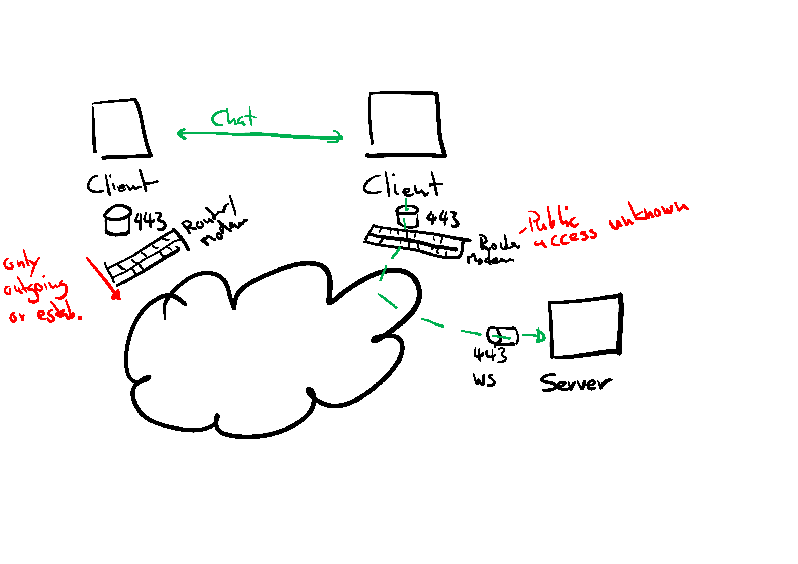
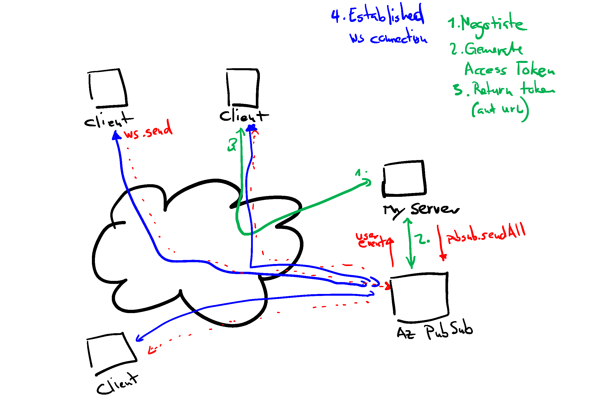

# Azure Web PubSub Servcie

Short introduction

---

# Sockets _(not WebSockets)_

are

- an abstraction of the network for an application
- can listen to incoming requests
- are exposed to the network by ports

---

# WebSockets

are

- an abstraction of the network for a web application
- can be used as a channel for 2-way communication
- is for (stream) communication between server and clients
- WebRTC is for direct communication between 2 clients

---

# Web PubSub

Service on top of WebSockets to

- manage connections
- manage groups (hubs, namespaces) and roles
- trigger events

---
# Applications
- Chat
- Collaboration (Whiteboard, Code...)
- Message streams (News, Logs)
- PubSub
...

---
# Demo Portal
# Demo CLI
---

---

---

# Code
---

# Scaling and Pricing

- 1 unit per 1000 concurrent connections
- ca. 1.50$ per day per unit
- max units 100

---

# Availability

*Preview* in 
- South East Asia
- North Europe
- West Europe
- East US
- West US 2

---
# Additional Features 

- Can react to messages in the stream and trigger an event hub
- Azure Functions Binding (not quite yet)
- Live trace tool

---
# Alternatives

- Socket.io (self-hosted)
- pusher.com
- ably
- pubnub
(- SignalR)
(- Firebase)
...

--- 

# Links
https://github.com/Azure/azure-sdk-for-js/tree/main/sdk/web-pubsub/web-pubsub/src
https://azure.github.io/azure-webpubsub/concepts/service-internals
https://github.com/Azure/azure-webpubsub/blob/main/samples
https://github.com/bbvch/WebPubSub